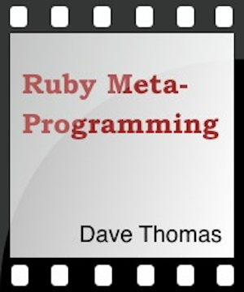

```
Roberto Nogueira  
BSd EE, MSd CE
Solution Integrator Experienced - Certified by Ericsson
```
# Pragmaticstudio Ruby Object Model and Metaprogramming



**About**

Metaprogramming lets you program more expressively. This makes your code easier to write and easier to maintain and extend. Learn both the hows and whys of metaprogramming Ruby from Dave Thomas, one of the most experienced Ruby programmers in the western world.

[Homepage](https://pragprog.com/screencast/v-dtrubyom/the-ruby-object-model-and-metaprogramming)

## Topics

__Episode 1: Objects and Classes (29 minutes)__
Just what is a Ruby object, and how can Ruby move you away from class-oriented development and back to object-oriented development? Learn about:

* [ ] the internals of objects,
* [ ] how classes really aren’t anything special,
* [ ] what self does, and the two ways it can get changed
* [ ] the method call mantra: “one to the right, then up,”
* [ ] singleton methods and ghost classes,
* [ ] why class methods don’t exist,
* [ ] how classes get their names,
* [ ] how the concept of the current class interacts with def

__Episode 2: Sharing Behavior (39 minutes)__
One of the primary goals of good design is to put the right behavior in the right place without duplication. We’ll see three ways Ruby excels at this:

* [ ] Using prototype-based programming, where you can create hierarchies of objects with controlled sharing of both state and behavior, and without a class definition in sight.
* [ ] Using inheritance (but you can only watch this section after you’ve watched the included Public Safety announcement on why inheritance is normally a bad idea). We’ll also look at what happens when you do class << object (and why it’s nothing whatsoever to do with inheritance).
* [ ] Using modules and mixins, the sweet spot of Ruby programming. How to using include and extend, and how to create modules that mix in both instance and class methods.

Episodes 1 and 2 are the foundation for the rest of the screencast.

__Episode 3: Dynamic Code (31 minutes)__
Metaprogramming is sometimes defined as “writing code that writes code.” Here we’ll see just how to do that in Ruby.

* [ ] Blocks and the two kinds of block-objects
* [ ] How bindings capture execution context
* [ ] How blocks can act as closures, and why that’s vital to metaprogramming
* [ ] Writing methods that define other methods using nested defs
* [ ] Using define_method
* [ ] Writing your own accessor methods

__Episode 4: instance_eval and class_eval (29 minutes)__
Two of the workhorse methods of metaprogramming are instance_eval and class_eval. They allow you to execute chunks of code dynamically. Here we’ll see how to use them.

* [ ] How instance_eval and class_eval differ
* [ ] When to use one versus the other
* [ ] Breaking down barriers
* [ ] Creating methods on the fly, but without using closures
* [ ] Defining stuff in classes given a class object
* [ ] Writing DSLs in a block structure

__Episode 5: Nine Examples of Metaprogramming (36 minutes)__
Here’s where all the theory and practice comes together! We’ll take a simple problem and find nine different ways of attacking it using metaprogramming techniques.

* [ ] Adding behavior directly inside the class
* [ ] Using subclassing to add behavior
* [ ] Subclassing with a generator using Class.new
* [ ] Using a ghost class
* [ ] Ghost class with a generator using class_eval
* [ ] Rewrite the method with alias_method
* [ ] Rewrite using a module
* [ ] Rewrite using bind
* [ ] Writing a DSL in a block

__Episode 6: Some Hook Methods (35 minutes)__
Ruby hook methods are a way for your application to hook itself into the execution of the Ruby interpreter. Using hook methods is crucial for some kinds of metaprogramming, and they can make your code more flexible. In this episode, we’ll see how to use two powerful hook methods: inherited and const_missing.

* [ ] Overriding hook methods to intercept and deal with certain Ruby interpreter events during the lifetime of your application
* [ ] Decoupling code using inherited to keep track of subclasses
* [ ] Implementing enumerated types with const_missing
* [ ] Using const_missing to autoload classes based on the names of files
* [ ] Applying const_missing in both global and localized situations
* [ ] How to chain an overridden hook method to its original hook method
* [ ] Using const_set to define constants
* [ ] Two practical uses for hook methods

__Episode 7: More Hook Methods (53 minutes)__
We’ll pick up where we left off in the last episode by looking at two more Ruby hook methods: included and method_added. But we’ll also take it a step further. We’ll use these hook methods to develop a metaprogramming library that traces the execution of a Ruby program. Along the way we’ll see all the various subtle (and important!) things you need to think about when you’re trying to write a general-purpose metaprogramming library.

* [ ] Using included to intercept when a module is included in a class, and use it to set up another hook method in a different context
* [ ] Using method_added to track when a new method is defined on a class, and trace the method’s execution
* [ ] Refactoring the tracing to support blocks
* [ ] Using method objects to bypass naming issues
* [ ] Adding tracing to methods that have already been added
* [ ] Suppressing tracing for certain methods
* [ ] Using Thread.current to define thread-local variables
* [ ] Differences between Ruby 1.8 and 1.9
* [ ] Practical examples (and corner cases) of metaprogramming
